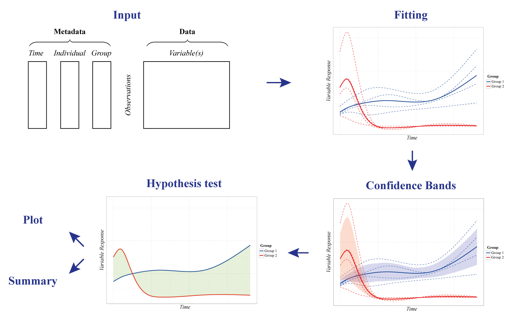
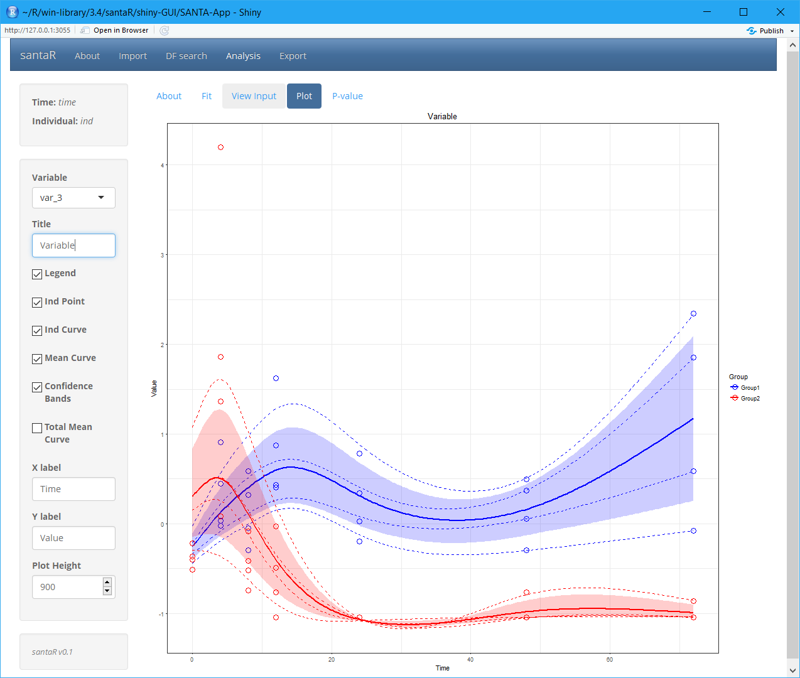

<!-- README.md is generated from README.Rmd. Please edit that file -->
santaR
======

Interactive package for *Short AsyNchronous Time-series Analysis* (SANTA), implemented in `R` and `Shiny`

Overview
--------

Longitudinal studies in Systems Biology face multiple challenges that are not suitably addressed by current time-series statistical methods: it is difficult to simultaneously account for *biological variability*, *measurement error*, *missing observations*, *asynchronous sampling*, *nonlinearity* and *low number of time points* (e.g. 4-10) with a *high number of variables*.

To address these challenges, `santaR` (*Short AsyNchronous Time-series Analysis*) provides a Functional Data Analysis (*FDA*) approach -*where the fundamental units of analysis are curves representing each individual across time*-, in a graphical and automated pipeline for robust analysis of short time-series studies.

Analytes levels are descriptive of the underlying biological state and evolve smoothly through time. For a single analyte, the time trajectory of each individual is described with a smooth curve estimated by smoothing splines. For a group of individuals, a curve representing the group mean trajectory is also calculated. These individual and group mean curves become the new observational unit for subsequent data analysis, that is, the estimation of the intra-class variability and the identification of trajectories significantly altered between groups.

Designed initially for metabolomic, `santaR` is also suited for other Systems Biology disciplines. Implemented in `R` and `Shiny`, `santaR` is developed as a complete and easy-to-use statistical software package, which enables command line and GUI analysis, with fast and parallel automated analysis and reporting. Comprehensive plotting options as well as automated summaries allow clear identification of significantly altered analytes for non-specialist users.



Installation
------------

Install the development version of the package directly from GitHub with:

``` r
# Install devtools
if(!require("devtools")) install.packages("devtools")
devtools::install_github("adwolfer/santaR")
```

If the dependency `pcaMethods` is not successfully installed, `Bioconductor` must be added to the default repositories with:

``` r
setRepositories(ind=1:2)
```

Usage
-----

To get started `santaR`'s graphical user interface implements all the functions for short asynchronous time-series analysis:

``` r
library(santaR)

santaR_start_GUI(browser = TRUE)
#  To exit press ESC in the command line
```

The graphical user interface is divided in 4 sections, corresponding to the main steps of analysis:

**Import**, **DF search**, **Analysis** and **Export**:

-   The **Import** tab manages input data in comma separated value (*csv*) format or as an *RData* file containing a previous analysis. Once data is imported the **DF search** and **Analysis** tabs become available.
-   **DF search** implements the tools for the selection of an optimal number of degrees of freedom (*df*).
-   With the data imported and a pertinent *df* selected, **Analysis** regroups the interface to visualise and identify variables significantly altered over time. A plotting interface enables the interactive visualisation of the raw data points, individual trajectories, group mean curves and confidence bands for all variables, which subsequently can be saved. Finally, if inter-group differential trajectories have been characterised, all significance testing results (with correction for multiple testing) are presented in interactive tables.
-   The **Export** tab manages the saving of results and automated reporting. Fitted data can be saved as an *RData* file for future analysis or reproduction of results. *csv* tables containing significance testing results can also be generated and summary plot for each significantly altered variable saved for rapid evaluation.



Vignettes and Demo data
-----------------------

More information is available in the graphical user interface as well as in the following vignettes:

-   [Getting Started with santaR](inst/doc/getting-started.html)
-   [How to prepare input data for santaR](inst/doc/prepare-input-data.html)
-   [santaR Graphical user interface use](inst/doc/santaR-GUI.pdf)
-   [santaR Theoretical Background](inst/doc/theoretical-background.html)
-   [Automated command line analysis](inst/doc/automated-command-line.html)
-   [Plotting options](inst/doc/plotting-options.html)
-   [Selecting an optimal number of degrees of freedom](inst/doc/selecting-optimal-df.html)
-   [Advanced command line options](inst/doc/advanced-command-line-functions.html)

A dataset containing the concentrations of 22 mediators of inflammation over an episode of acute inflammation is also available. The mediators have been measured at 7 time-points on 8 subjects, concentration values have been unit-variance scaled for each variable. A subset of the data is presented below:

``` r
## Metadata
acuteInflammation$meta
```

<table style="width:32%;">
<colgroup>
<col width="9%" />
<col width="11%" />
<col width="11%" />
</colgroup>
<thead>
<tr class="header">
<th align="center">time</th>
<th align="center">ind</th>
<th align="center">group</th>
</tr>
</thead>
<tbody>
<tr class="odd">
<td align="center">4</td>
<td align="center">ind_6</td>
<td align="center">Group2</td>
</tr>
<tr class="even">
<td align="center">4</td>
<td align="center">ind_7</td>
<td align="center">Group1</td>
</tr>
<tr class="odd">
<td align="center">4</td>
<td align="center">ind_8</td>
<td align="center">Group2</td>
</tr>
<tr class="even">
<td align="center">8</td>
<td align="center">ind_1</td>
<td align="center">Group1</td>
</tr>
<tr class="odd">
<td align="center">8</td>
<td align="center">ind_2</td>
<td align="center">Group2</td>
</tr>
<tr class="even">
<td align="center">8</td>
<td align="center">ind_3</td>
<td align="center">Group1</td>
</tr>
</tbody>
</table>

``` r
## Data
acuteInflammation$data
```

<table style="width:60%;">
<colgroup>
<col width="13%" />
<col width="15%" />
<col width="15%" />
<col width="15%" />
</colgroup>
<thead>
<tr class="header">
<th align="center">var_1</th>
<th align="center">var_2</th>
<th align="center">var_3</th>
<th align="center">var_4</th>
</tr>
</thead>
<tbody>
<tr class="odd">
<td align="center">2.668</td>
<td align="center">2.464</td>
<td align="center">1.365</td>
<td align="center">1.743</td>
</tr>
<tr class="even">
<td align="center">-0.3002</td>
<td align="center">0.05366</td>
<td align="center">0.4509</td>
<td align="center">0.01572</td>
</tr>
<tr class="odd">
<td align="center">3.777</td>
<td align="center">2.543</td>
<td align="center">1.858</td>
<td align="center">2.213</td>
</tr>
<tr class="even">
<td align="center">-0.3275</td>
<td align="center">0.1564</td>
<td align="center">0.585</td>
<td align="center">0.03299</td>
</tr>
<tr class="odd">
<td align="center">0.708</td>
<td align="center">0.4893</td>
<td align="center">-0.08219</td>
<td align="center">0.9345</td>
</tr>
<tr class="even">
<td align="center">-0.4101</td>
<td align="center">-0.03727</td>
<td align="center">-0.2914</td>
<td align="center">-0.7239</td>
</tr>
</tbody>
</table>

Other tips
----------

The GUI is to be prefered to understand the methodology, select the best parameters on a subset of the data before running the command line, or to visually explore results.

If a very high number of variables is to be processed, `santaR`'s command line functions are more efficient, as they can be integrated in scripts and the reporting automated.

Copyright
---------

`santaR` is licensed under the [GPLv3](http://choosealicense.com/licenses/gpl-3.0/)

As a summary, the GPLv3 license requires attribution, inclusion of copyright and license information, disclosure of source code and changes. Derivative work must be available under the same terms.

© Arnaud Wolfer (2017)
